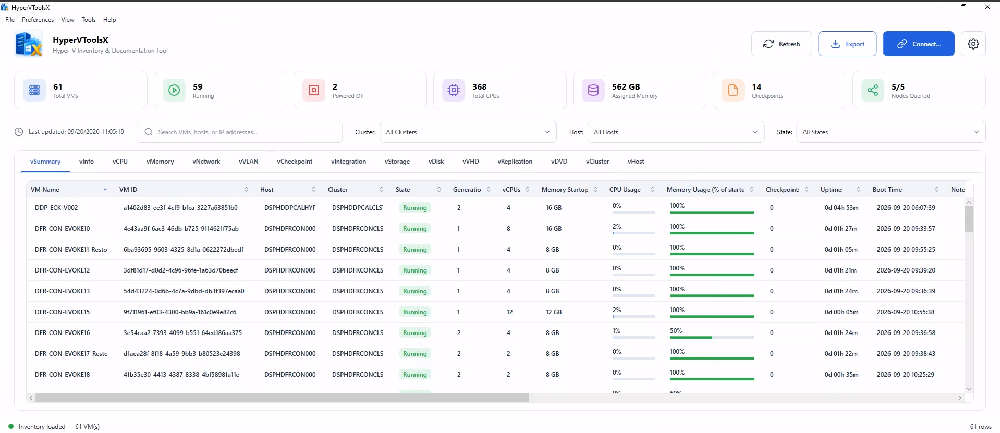
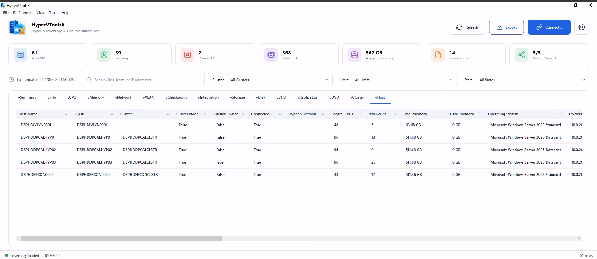
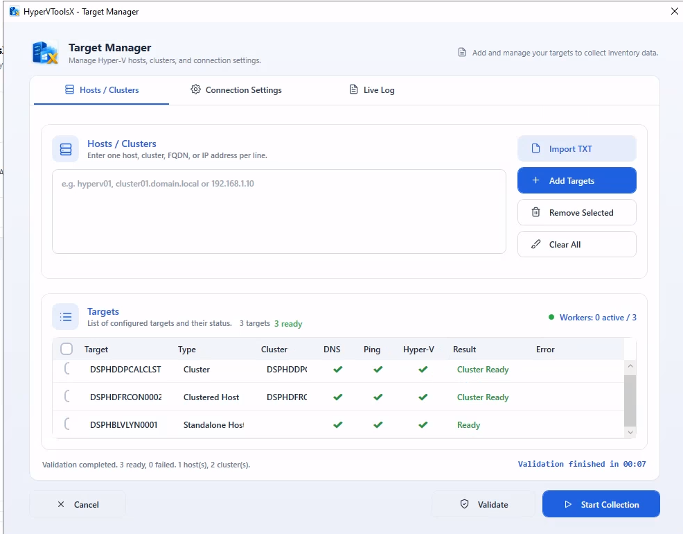
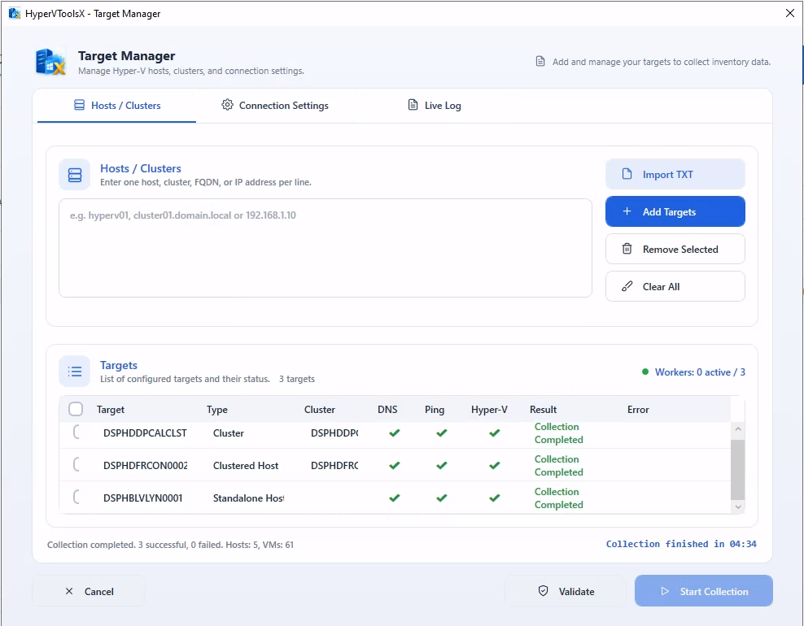

<div align="center">


# HyperVToolsX

**Hyper-V Inventory & Documentations Tool — an RVTools-style desktop app for Microsoft Hyper-V.**


</div>

---

## Table of contents

- [Overview](#overview)
- [Features](#features)
- [Screenshots](#screenshots)
- [Inventory tabs](#inventory-tabs)
- [Requirements](#requirements)
- [Getting started](#getting-started)
- [Using the application](#using-the-application)
- [Custom tabs (templates)](#custom-tabs-templates)
- [Exporting to Excel](#exporting-to-excel)
- [Command-line mode](#command-line-mode)
- [Connecting to remote hosts](#connecting-to-remote-hosts)
- [How it works](#how-it-works)
- [Architecture](#architecture)
- [Repository layout](#repository-layout)
- [Building, testing and publishing](#building-testing-and-publishing)
- [Security notes](#security-notes)
- [Project status and roadmap](#project-status-and-roadmap)
- [Contributing](#contributing)
- [License](#license)

---

## Overview

HyperVToolsX is a Windows desktop inventory and documentation tool for Hyper-V environments, inspired by
[RVTools](https://www.robware.net/rvtools/) for VMware. It connects to one or more standalone Hyper-V hosts or
failover-cluster nodes, collects detailed configuration data, and presents it in a familiar tabbed grid interface
for auditing, documentation and troubleshooting.

- **Agentless** — nothing is installed on the targets; data is gathered with the Hyper-V PowerShell module,
  locally or over WinRM.
- **Cluster-aware** — give a cluster name and every node is found and collected; the node that owns the cluster is marked.
- **Self-contained** — publishes as a single-file, self-contained `win-x64` executable that needs no .NET
  runtime on the machine.

## Features

- **Host and VM inventory** — logical processors, memory, VM count, state, generation, version, boot time and uptime.
- **Fourteen inventory tabs** modelled on RVTools (`vInfo`, `vCPU`, `vMemory`, `vNetwork`, `vVLAN`, `vCheckpoint`,
  `vIntegration`, `vStorage`, `vDisk`, `vVHD`, `vReplication`, `vDVD`, `vCluster`, `vHost`).
- **Target management** — add hosts, clusters or IP addresses; duplicates are removed automatically.
- **Staged target validation** — name resolution, ping, WinRM connection, Hyper-V role detection and cluster
  discovery, each reported with its own status.
- **Flexible WinRM connection settings** — current Windows credentials or explicit user, authentication mechanism
  (Default, Negotiate, Kerberos, Basic, CredSSP), HTTP/HTTPS, custom port, timeout, and certificate-check options.
- **Automatic TrustedHosts handling** for workgroup targets addressed by bare IP.
- **Concurrent, throttled collection** — between 1 and 10 targets are collected in parallel.
- **Custom tabs** — build your own tabs from fields of one or several inventory tabs (one row per VM), saved as XML in a `Templates` folder and loaded on every start; they are also exported as the first sheets of the workbook.
- **Command-line mode** — `HyperVToolsX.exe /host:HV01 /export:C:\Reports /type:xlsx` collects and exports without opening the window, for scheduled tasks.
- **Search and filter** — free-text search (`Ctrl+F`) plus filtering by cluster, host or state.
- **Live summary bar** — VM totals, running/off counts, vCPUs, assigned memory, checkpoints and nodes queried.
- **Data size unit preference** — display sizes as Bytes, KB, MB, GB, TB or PB.
- **Live log** — a dedicated tab shows every step (resolution, remoting, TrustedHosts, collection) as it happens.
- **In-memory cache** — the UI reads from a snapshot and can be refreshed independently of collection.

## Screenshots

**vSummary** — one row per VM with state, vCPUs, startup memory, CPU and memory usage, checkpoints, uptime and boot
time, plus NICs, IP/MAC addresses, VLANs and storage paths (scroll right).



**vHost** — every host with its cluster membership, cluster owner, logical CPUs, VM count, memory and operating system.



**Target Manager** — add hosts, clusters or IP addresses and validate them stage by stage (DNS, ping, Hyper-V) before
collecting.



Collection runs the targets in parallel and reports per-target results and the elapsed time.



## Inventory tabs

| Tab | Contents |
| --- | --- |
| **vInfo** | VM summary: host, cluster, IP, state, vCPUs, memory, generation, version, boot time, uptime |
| **vCPU** | Processor count, reservations/limits, weights, NUMA and virtualization-extension settings |
| **vMemory** | Startup/min/max memory, dynamic memory, buffer and priority |
| **vNetwork** | Adapters, switch, MAC, IPv4/IPv6, status |
| **vVLAN** | VLAN mode, access VLAN ID, allowed VLAN lists |
| **vCheckpoint** | Checkpoint name, type, ID, creation time, parent |
| **vIntegration** | Integration services and their enabled/heartbeat state |
| **vStorage** | VM storage paths (configuration, checkpoint, smart paging, guest state) |
| **vDisk** | Attached virtual disks, controller type/number/location, backing type |
| **vVHD** | VHD/VHDX details: type, file size, block size, alignment, fragmentation |
| **vReplication** | Replication state, mode, frequency, last replication, compression, excluded disks |
| **vDVD** | DVD drives and mounted media |
| **vCluster** | Cluster name, functional level, quorum, thresholds, auto-balancer and related settings |
| **vHost** | Host FQDN, Hyper-V version, OS build, memory, default paths, live-migration and Enhanced Session Mode settings |

Additional workspace tabs: **Hosts / Clusters** (target manager), **Connection Settings**, and **Live Log**.

## Requirements

**To run the application**

- Windows 10 version 1809 (build 17763) or later, x64
- Administrator rights — the app manifest requests elevation (`requireAdministrator`), needed for TrustedHosts changes
- Windows PowerShell 5.1 with the **Hyper-V PowerShell module** available on the machine running the collection
  (local target) or on the remote hosts (WinRM target)
- For remote targets: WinRM enabled and reachable, and permission to query Hyper-V
  (local admin or delegated Hyper-V Administrator)

**To build from source**

- [.NET 10 SDK](https://dotnet.microsoft.com/download) with the Windows desktop workload
- Visual Studio 2022/2026 (optional) or the `dotnet` CLI

## Getting started

### Run from source

```powershell
git clone https://github.com/DarkPhoenix2016/HyperVToolsX.git
cd HyperVToolsX
dotnet run --project HyperVToolsX.App
```

Run the terminal as Administrator, otherwise the elevation prompt will be triggered on launch.

### Use a published build

Publish a self-contained single-file executable (see [Publishing](#publishing)), then run `HyperVToolsX.exe`.

## Using the application

1. **Connect** — `File → Connect...` (`Ctrl+N`) or the **Connect** button. Enter host names, cluster names or IP
   addresses (one or more).
2. **Validate** — each target moves through resolving, pinging, connecting, Hyper-V detection and cluster discovery.
   Failures are shown per target with the failing stage.
3. **Collect** — validated targets are collected concurrently and results appear across the inventory tabs.
4. **Explore** — switch tabs, filter by cluster/host/state, or search with `Ctrl+F`.
5. **Refresh** — `F5` or the **Refresh** button re-collects the connected targets.
6. **Disconnect** — `File → Disconnect Selected` or `Disconnect All` removes targets from the cache.

### Keyboard shortcuts

| Shortcut | Action |
| --- | --- |
| `Ctrl+N` | Connect to targets |
| `F5` | Refresh |
| `Ctrl+F` | Focus search |
| `Ctrl+E` | Export to Excel |
| `Esc` | Clear search |

### Menus

- **File** — Connect, Disconnect Selected, Disconnect All, Export to Excel, Exit
- **Preferences** — Data Size Unit (Bytes / KB / MB / GB / TB / PB)
- **Tools** — New Custom Tab..., Manage Custom Tabs...
- **Help** — About HyperVToolsX

## Custom tabs (templates)

Besides the built-in tabs you can define your own tab containing only the fields you care about, taken from
**one or several** inventory tabs.

**Create one:** `Tools -> New Custom Tab...`

1. Enter a **tab name**.
2. Choose what each **row** is:
   - **Virtual machines (one row per VM)** - the default. You can mix fields from any per-VM tab (`vInfo`, `vCPU`,
     `vMemory`, `vNetwork`, `vVLAN`, `vCheckpoint`, `vIntegration`, `vStorage`, `vDisk`, `vVHD`, `vReplication`,
     `vDVD`) plus the VM's host (`vHost`) and cluster (`vCluster`).
   - **Hosts**, **Clusters**, **Host storage** or **Operating systems** - lists that tab's own rows (fields of that tab only).
3. Move fields from **Available fields** to **Columns in this tab** (Add / double-click). Use the tab drop-down and the
   filter box to find fields; every entry shows the tab it comes from. Reorder with Up / Down and optionally rename a header.
4. **Save.** The tab appears after the built-in tabs and fills with data on every collection.

`Tools -> Manage Custom Tabs...` lists, edits and deletes templates.

**How VM rows are combined.** Each VM gets exactly one row. Fields from another tab are looked up for that VM
(by VM id where available, otherwise by VM name and host; VHD files through the VM's disks). If a VM has **several**
entries in that tab - two network adapters, several disks - they are collapsed into one cell separated by `; `
(for example `00-15-5D-01, 00-15-5D-02`), in the same order across columns of the same tab, so the Nth value of one
`vNetwork` column lines up with the Nth value of another. A VM with no entry leaves the cell empty. Collapsed
cells sort by their first value.

**Where they are stored.** Each template is one XML file in a `Templates` folder next to `HyperVToolsX.exe`
(created automatically on first start). On every start the app reads all `*.xml` files in that folder and builds a
tab for each one, so templates can also be copied between machines or edited by hand:

```xml
<?xml version="1.0" encoding="utf-8"?>
<CustomTab Name="Capacity" Source="vInfo">
  <DataGrid>
    <Column Source="vInfo" Field="Name" Header="VM Name" />
    <Column Source="vInfo" Field="HostName" Header="Host" />
    <Column Source="vMemory" Field="Startup" Header="Startup Memory" />
    <Column Source="vNetwork" Field="MacAddress" Header="MAC Addresses" />
  </DataGrid>
</CustomTab>
```

- The root `Source` is the row source: `vInfo` means one row per VM; `vHost`, `vCluster`, `vHostStorage` and `vOS`
  list that tab's rows. Each `Column` has the tab it comes from (`Source`) and the property name (`Field`).
- Files from the first version (no `Source` on columns) still load. One whose root `Source` was a per-VM tab other than
  `vInfo` (for example `vNetwork`, formerly one row per adapter) now loads as a one-row-per-VM tab with those columns collapsed.
- Files that are malformed, use an unknown source, or have no valid columns are skipped and reported in the
  **Live Log**; columns with an unknown field or a tab not allowed for the row source are ignored.
- The tab name is also the file name and the Excel sheet name, so it is limited to 31 characters, can't contain
  `\ / ? * [ ] :`, and can't reuse a built-in tab name.
- Size fields follow the *Data Size Unit* preference on screen, like the built-in tabs.

## Exporting to Excel

`File → Export to Excel...` (`Ctrl+E`) or the **Export** button writes the current inventory snapshot to an
`.xlsx` workbook using ClosedXML.

- **Custom tabs come first:** each template is written as a sheet, in the order of its columns, before the built-in sheets.
- One worksheet per built-in tab: `vInfo`, `vCPU`, `vMemory`, `vNetwork`, `vVLAN`, `vCheckpoint`, `vIntegration`,
  `vStorage`, `vDisk`, `vVHD`, `vReplication`, `vDVD`, `vCluster`, `vHost` (host, OS and storage joined as on screen), plus `vHostStorage` and `vOS`.
- Built-in sheets include every collected field; custom sheets contain only the template's columns and headers.
- Header row is styled, frozen and auto-filtered; columns are auto-sized.
- Size columns (memory, VHD sizes, host memory, etc.) are converted to the unit currently selected under
  *Preferences → Data Size Unit*, which is **GB** by default, and the unit is shown in the header, e.g.
  `Memory Assigned (GB)`. Values stay numeric so they sort and calculate correctly.
- List values are joined with `; `; text is never interpreted as a formula.
- The export runs off the UI thread; the status bar confirms when it is complete.

## Command-line mode

Start the exe **with arguments** and it runs headless: it collects the given hosts, writes the export and exits with
a code, without showing the window. Without arguments the normal window opens.

```
HyperVToolsX.exe /host:<hostname> /export:<folder> /type:<xlsx|csv> [options]
HyperVToolsX.exe /hostfile:<hosts.txt> /export:<folder> /type:<xlsx|csv> [options]
```

The only required inputs are **which hosts**, **where to save** (`/export`, a folder) and **the format** (`/type`);
the file name is generated for you.

| Option | Description |
| --- | --- |
| `/host:<name>` | Hyper-V host or cluster name. Several: `/host:HV01,HV02` |
| `/hostfile:<path>` | Text file with host names, one per line. Blank lines and lines starting with `#` are ignored; commas and semicolons also separate names. Can be combined with `/host`. One of `/host` or `/hostfile` is required |
| `/export:<folder>` | **Required.** Folder for the output (created if missing). Every host gets its own file |
| `/type:<format>` | **Required with a folder.** `xlsx` or `csv` |
| `/user:<username>` | Username (`domain\user`). Without it the current Windows user is used |
| `/password:<pwd>` | Password (use with `/user`). Visible in the process list; prefer `/passwordfile` |
| `/passwordfile:<file>` | Read the password from the first line of a file (protect it with an ACL). If neither this nor `/password` is given, the `HVTX_PASSWORD` environment variable is used |
| `/auth:<method>` | `Default`, `Negotiate`, `Kerberos`, `Basic`, `CredSSP` |
| `/ssl` | Use HTTPS (port 5986) |
| `/port:<number>` | Custom port (default 5985/5986) |
| `/skipca` / `/skipcn` | Skip the CA certificate / CN hostname check (weakens TLS validation; use only for self-signed lab certificates) |
| `/trusthosts` | Allow adding a bare-IP target to this machine's WinRM TrustedHosts. Without it, IP targets that would need TrustedHosts are refused; prefer hostnames or `/ssl` |
| `/timeout:<secs>` | Connection timeout (default 30) |
| `/optimeout:<secs>` | Maximum run time of one remote script per host; the host is failed and its process killed when exceeded (default 300) |
| `/unit:<unit>` | Unit for exported sizes: `Bytes`, `KB`, `MB`, `GB`, `TB`, `PB` (default `GB`) |
| `/silent` | Suppress all output (for scheduled tasks) |
| `/?` | Show the help |

Switches are case-insensitive and may also be written `-name` or `--name`, with `:` or `=` before the value.

```
HyperVToolsX.exe /host:HV01 /export:C:\Reports /type:xlsx
HyperVToolsX.exe /hostfile:C:\hosts.txt /export:D:\Out /type:xlsx /ssl
HyperVToolsX.exe /host:HV01.domain.com /export:D:\Out /type:csv /auth:Kerberos
```

**One file per host.** Every host is collected on its own (up to 10 at a time) and written to its own file (a cluster
name gets a folder with one file per node, see [Clusters](#clusters)), named
`<hostname>_<yyyyMMdd-HHmmss>` in the export folder, for example `C:\Reports\HV01_20260920-031500.xlsx`. With
`/hostfile` listing 50 hosts you get 50 files. A host that fails (unreachable, no Hyper-V, bad credentials) is reported
and skipped without affecting the others. Characters that are not allowed in file names are replaced with `_`, and every run
has a new timestamp, so scheduled runs never overwrite each other.

With a **single** host, a complete file path also works instead of a folder (`/export:D:\out.xlsx`); the format then
follows the extension and `/type` is optional. With several hosts `/export` must be a folder.

- **It uses the same pipeline as the window**: the same validation, collection and connection behaviour.
- **Custom tabs are included automatically** for both `.xlsx` and `.csv`: the `Templates` folder next to the exe is checked
  on every run, and if it holds templates they are exported first (the console lists which ones, or says none were found).
- **.csv** writes one file per tab for each host: `HV01_20260920-031500-vInfo.csv`, `...-vCPU.csv`, and so on (custom
  tabs are named after the tab). Tabs without rows are skipped. Files are UTF-8 with a BOM, and text that starts with `=`, `+`, `-` or
  `@` gets a leading apostrophe so Excel doesn't run it as a formula.
- **Exit codes:** `0` every host exported, `1` failure (no host exported, cancelled, or an error), `2` invalid arguments,
  `3` some hosts exported and at least one failed.
- **Ctrl+C** cancels a run.

Notes:

- The app manifest requests administrator rights, so starting it from a normal (non-elevated) prompt shows the UAC
  prompt and opens the output in a **new console window**; it stays open until you press a key. Run it from an
  elevated prompt to see the output in that prompt, or use `/silent` in a scheduled task set to *Run with highest
  privileges*.
- The exe is a Windows (GUI) program, so `cmd` and PowerShell don't wait for it by default. To wait and read the exit
  code use `start /wait HyperVToolsX.exe ...` in `cmd`, or `Start-Process -Wait -PassThru` in PowerShell.
- `/password` is visible in the process list and in the task definition. Prefer the current Windows identity
  (omit `/user`) or a credential you are comfortable storing that way.

## Connecting to remote hosts

Connection behaviour is configured on the **Connection Settings** tab and applies to the next operation.

| Setting | Description |
| --- | --- |
| Use current credentials | Run as the current Windows user (default) |
| Username / Password | Explicit credentials |
| Authentication | `Default`, `Negotiate`, `Kerberos`, `Basic`, `CredSSP` |
| Use SSL | WinRM over HTTPS (port 5986 by default, otherwise 5985) |
| Port | `0` uses the WinRM default for the chosen transport |
| Timeout | Seconds, default `30` |
| Skip CA certificate check | For HTTPS targets with untrusted certificates |
| Skip CN check | For HTTPS targets whose certificate name does not match |

**Targets addressed by IP.** Default/Negotiate authentication cannot pass through to a bare IP address
(NTLM-reflection protection). Use a resolvable hostname, or supply explicit credentials. For workgroup targets,
HyperVToolsX will add the IP to `WSMan:\localhost\Client\TrustedHosts` — it only ever appends, and never modifies
or removes existing entries (including `*`).

## How it works

```
 UI (WPF)
   │  targets, request
   ▼
 CollectionOrchestrator ──► TargetValidator ──► resolve → ping → WinRM → Hyper-V role → cluster discovery
   │
   ▼
 RemoteInventoryCollector ──► RemoteScriptRunner ──► Windows PowerShell 5.1
   │                              (local, or Invoke-Command over WinRM)
   ▼
 RemoteInventoryMapper ──► Core models ──► InventoryCache ──► UI snapshot
```

1. Target names are normalized and de-duplicated (`TargetNormalizer`, `TargetManager`).
2. `TargetValidator` verifies each target in stages and detects standalone hosts vs. clusters vs. clustered nodes.
3. `RemoteScriptRunner` runs a script in a child **Windows PowerShell 5.1** process — directly for the local machine,
   or with `Invoke-Command` for remote ones — using the shared connection options. Output is returned as JSON.
4. `RemoteInventoryMapper` maps the JSON payload into Core models (VMs, processors, memory, adapters, VLANs,
   checkpoints, integration services, storage, disks, VHDs, replication, DVDs, host storage, OS, clusters).
5. `InventoryCache` holds the latest `InventorySnapshot`; the UI binds to it and updates independently of collection.

Collection scope is controlled by `CollectionRequest` (CPU, memory, storage, network, checkpoints, integration
services, and `MaxConcurrentTargets`, default 10). The worker pool is clamped between 1 and 10 by
`WorkerConfiguration`.

### Clusters

Enter a **cluster name** (the cluster's own name, not a node) as a target and HyperVToolsX collects the whole cluster:

1. Validation detects that the name is a cluster (`Cluster` in the target list); a node entered by name is a
   `Clustered Host` and only that node is collected.
2. The nodes are listed with `Get-ClusterNode`. A cluster name only reaches whichever node currently owns it, and
   `Get-VM` only lists the VMs running on the node it runs on, so **each node is then collected on its own** (up to 4 at
   a time) and the results are combined under the cluster. Nodes that are `Down` are skipped with a warning; if a node
   fails the others are still collected (see the Live Log); if none can be collected the target fails.
3. **Each node appears once** on the vHost tab (and in exports), including the owner. If you also add a node separately,
   or add the same host under two names, the duplicate is left out of the inventory.
4. The vHost tab has a **Cluster Owner** column that is `True` for the node that currently owns the cluster core group
   (the cluster name); it is included in the exports as well.

In command-line mode a cluster name is written as **one file per node inside a folder named after the cluster**, e.g.
`/host:CL1 /export:C:\Reports /type:xlsx` gives `C:\Reports\CL1\NODE1_20260920-031500.xlsx`,
`C:\Reports\CL1\NODE2_20260920-031500.xlsx`, and so on. Each node's file holds only that node (its host row, VMs, disks,
NICs, ...) plus your custom tabs, and the owner node has `Cluster Owner = True`.

## Architecture

The solution follows a layered design with a provider-agnostic core.

| Project | Type | Responsibility |
| --- | --- | --- |
| `HyperVToolsX.Core` | Class library (`net10.0`) | Models, enums and interfaces (`IHyperVProvider`, `IInventoryCollector`, `IInventoryCache`, `ITargetManager`, `ITargetValidator`, `IHostReportCollector`), collection request/progress/result types, `ILiveLog`, the field catalog (`InventoryCatalog`), `CustomTabTemplate` and the command-line parser |
| `HyperVToolsX.Infrastructure` | Class library (`net10.0`) | `PowerShellExecutor`, `RemoteScriptRunner`, `TrustedHostsManager`, `ConnectionNameResolver`, `TargetValidator`, `HyperVProvider`, collectors, `CollectionOrchestrator`, `InventoryCache`, `TemplateStore` (XML templates). References `Microsoft.PowerShell.SDK` 7.6.6 |
| `HyperVToolsX.Export` | Class library (`net10.0`) | `ExcelInventoryExporter` and `CsvInventoryExporter` (implement `IInventoryExporter`, write custom tabs first) — writes the inventory to `.xlsx` using [ClosedXML](https://github.com/ClosedXML/ClosedXML) |
| `HyperVToolsX.App` | WPF app (`net10.0-windows10.0.17763.0`) | Main window, target manager view, About window, value converters, app manifest |
| `HyperVToolsX.Tests` | xUnit tests | Provider, target manager, validator, exporter, template store, custom-tab join and command-line tests |

Dependency direction: `App → Infrastructure → Core`, `App → Export`, `Tests → Core, Infrastructure`.

## Repository layout

```
HyperVToolsX/
├── HyperVToolsX.slnx                 Solution file
├── Resources/                        Logo assets (logo.png, icon)
├── HyperVToolsX.App/                 WPF client
│   ├── MainWindow.xaml(.cs)          Tabbed inventory grids, menus, shortcuts
│   ├── Views/                        TargetManagerView, AboutWindow, TemplateEditor/ManagerWindow
│   ├── Cli/                          Command-line runner and console handling
│   ├── Converters/                   BoolToGlyph, ByteSize, StatusToBrush
│   ├── Properties/                   Settings, publish profiles
│   └── app.manifest                  requireAdministrator
├── HyperVToolsX.Core/                Models, enums, interfaces, collection types, custom-tab templates
├── HyperVToolsX.Infrastructure/      PowerShell, remoting, validation, collectors
├── HyperVToolsX.Export/              Excel export (ClosedXML)
└── HyperVToolsX.Tests/               xUnit tests
```

## Building, testing and publishing

### Build

```powershell
dotnet build HyperVToolsX.slnx -c Release
```

### Test

```powershell
dotnet test HyperVToolsX.Tests
```

> The provider and validator tests exercise the local machine (`GetLocalHost`, `GetLocalVirtualMachines`, local target
> validation), so they require a Windows machine with the Hyper-V role and module, and elevation.

### Publishing

The app project is configured for a self-contained, single-file, ReadyToRun `win-x64` build (trimming is
disabled):

```powershell
dotnet publish HyperVToolsX.App -c Release -p:PublishProfile=FolderProfile
```

Output goes to `HyperVToolsX.App/bin/publish/win-x64/`. Before distributing, Authenticode-sign `HyperVToolsX.exe`
(the app runs elevated, so an unsigned build triggers SmartScreen and UAC "unknown publisher" warnings):

```powershell
signtool sign /fd SHA256 /tr http://timestamp.digicert.com /td SHA256 /a HyperVToolsX.App\bin\publish\win-x64\HyperVToolsX.exe
```

Install into a directory only administrators can write (for example `C:\Program Files\HyperVToolsX`): the app runs
elevated and loads the `Templates` folder beside the executable.

## Security notes

- Scripts are delivered to the child Windows PowerShell process over its stdin pipe, never through a file in a
  user-writable temp folder. Explicit passwords travel the same private pipe (as a `SecureString`), so they are not
  in script text, the environment, files or the command line, and must never be logged. The file log also redacts
  `password=`-style text.
- Authentication values are validated against an allow-list rather than interpolated into scripts; only a parsed IP
  address is ever embedded in the TrustedHosts script.
- TrustedHosts changes are append-only and only made when you opt in (Connection Settings, or `/trusthosts`).
  Basic authentication over HTTP is refused.
- Every remote run has a hard deadline (`/optimeout`, default 300 s); a host that stops responding is failed and its
  PowerShell process is killed.
- Logs are written to `%LOCALAPPDATA%\HyperVToolsX\logs` (14 days retained, 10 MB per day). Prefer hostnames with Kerberos, or HTTPS with valid certificates, over
  TrustedHosts and the certificate-skip options.
- The application requires administrator elevation.

## Project status and roadmap

**Release (`1.0.0`).** The collection pipeline and the inventory tabs are in place. See the [changelog](CHANGELOG.md) for version history.

- [x] Local and remote (WinRM) collection with staged validation
- [x] Cluster discovery and cluster-aware roll-up
- [x] Fourteen inventory tabs, search/filter, size-unit preference, live log
- [x] Excel export to `.xlsx` (ClosedXML)
- [x] Custom tabs saved as XML templates and exported as leading sheets
- [x] Command-line mode (`/host`, `/export`, `.xlsx` and `.csv`) for scheduled exports
- [ ] Larger-fleet tuning (design target: 100+ hosts, 1,000+ VMs)
- [ ] Broader automated test coverage (mock-based tests that don't require Hyper-V)

## Contributing

Issues and pull requests are welcome. Development happens on the `development` branch; `master` receives merges
from it. Please keep changes focused, follow the existing code style, and run the test suite before submitting.

## License

Released under the [MIT License](HyperVToolsX.App/LICENSE.txt).

Copyright © 2026 Charitha Piyumal
