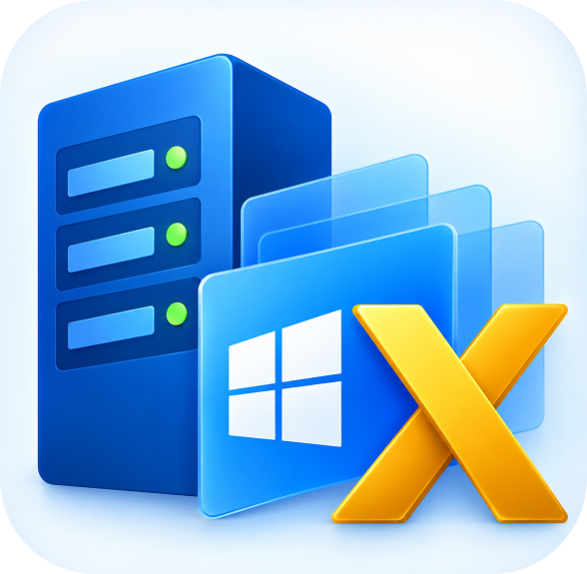

<div align="center">



# HyperVToolsX

**Hyper-V Inventory & Management Tool — an RVTools-style desktop app for Microsoft Hyper-V.**


</div>

---

## Table of contents

- [Overview](#overview)
- [Features](#features)
- [Inventory tabs](#inventory-tabs)
- [Requirements](#requirements)
- [Getting started](#getting-started)
- [Using the application](#using-the-application)
- [Connecting to remote hosts](#connecting-to-remote-hosts)
- [How it works](#how-it-works)
- [Architecture](#architecture)
- [Repository layout](#repository-layout)
- [Building, testing and publishing](#building-testing-and-publishing)
- [Security notes](#security-notes)
- [Project status and roadmap](#project-status-and-roadmap)
- [Contributing](#contributing)
- [License](#license)

---

## Overview

HyperVToolsX is a Windows desktop inventory and documentation tool for Hyper-V environments, inspired by
[RVTools](https://www.robware.net/rvtools/) for VMware. It connects to one or more standalone Hyper-V hosts or
failover-cluster nodes, collects detailed configuration data, and presents it in a familiar tabbed grid interface
for auditing, documentation and troubleshooting.

- **Agentless** — nothing is installed on the targets; data is gathered with the Hyper-V PowerShell module,
  locally or over WinRM.
- **Cluster-aware** — cluster membership is discovered so hosts and VMs roll up correctly.
- **Self-contained** — publishes as a single-file, self-contained `win-x64` executable that needs no .NET
  runtime on the machine.

## Features

- **Host and VM inventory** — logical processors, memory, VM count, state, generation, version, boot time and uptime.
- **Fourteen inventory tabs** modelled on RVTools (`vInfo`, `vCPU`, `vMemory`, `vNetwork`, `vVLAN`, `vCheckpoint`,
  `vIntegration`, `vStorage`, `vDisk`, `vVHD`, `vReplication`, `vDVD`, `vCluster`, `vHost`).
- **Target management** — add hosts, clusters or IP addresses; duplicates are removed automatically.
- **Staged target validation** — name resolution, ping, WinRM connection, Hyper-V role detection and cluster
  discovery, each reported with its own status.
- **Flexible WinRM connection settings** — current Windows credentials or explicit user, authentication mechanism
  (Default, Negotiate, Kerberos, Basic, CredSSP), HTTP/HTTPS, custom port, timeout, and certificate-check options.
- **Automatic TrustedHosts handling** for workgroup targets addressed by bare IP.
- **Concurrent, throttled collection** — between 1 and 10 targets are collected in parallel.
- **Search and filter** — free-text search (`Ctrl+F`) plus filtering by cluster, host or state.
- **Live summary bar** — VM totals, running/off counts, vCPUs, assigned memory, checkpoints and nodes queried.
- **Data size unit preference** — display sizes as Bytes, KB, MB, GB, TB or PB.
- **Live log** — a dedicated tab shows every step (resolution, remoting, TrustedHosts, collection) as it happens.
- **In-memory cache** — the UI reads from a snapshot and can be refreshed independently of collection.

## Inventory tabs

| Tab | Contents |
| --- | --- |
| **vInfo** | VM summary: host, cluster, IP, state, vCPUs, memory, generation, version, boot time, uptime |
| **vCPU** | Processor count, reservations/limits, weights, NUMA and virtualization-extension settings |
| **vMemory** | Startup/min/max memory, dynamic memory, buffer and priority |
| **vNetwork** | Adapters, switch, MAC, IPv4/IPv6, status |
| **vVLAN** | VLAN mode, access VLAN ID, allowed VLAN lists |
| **vCheckpoint** | Checkpoint name, type, ID, creation time, parent |
| **vIntegration** | Integration services and their enabled/heartbeat state |
| **vStorage** | VM storage paths (configuration, checkpoint, smart paging, guest state) |
| **vDisk** | Attached virtual disks, controller type/number/location, backing type |
| **vVHD** | VHD/VHDX details: type, file size, block size, alignment, fragmentation |
| **vReplication** | Replication state, mode, frequency, last replication, compression, excluded disks |
| **vDVD** | DVD drives and mounted media |
| **vCluster** | Cluster name, functional level, quorum, thresholds, auto-balancer and related settings |
| **vHost** | Host FQDN, Hyper-V version, OS build, memory, default paths, live-migration and Enhanced Session Mode settings |

Additional workspace tabs: **Hosts / Clusters** (target manager), **Connection Settings**, and **Live Log**.

## Requirements

**To run the application**

- Windows 10 version 1809 (build 17763) or later, x64
- Administrator rights — the app manifest requests elevation (`requireAdministrator`), needed for TrustedHosts changes
- Windows PowerShell 5.1 with the **Hyper-V PowerShell module** available on the machine running the collection
  (local target) or on the remote hosts (WinRM target)
- For remote targets: WinRM enabled and reachable, and permission to query Hyper-V
  (local admin or delegated Hyper-V Administrator)

**To build from source**

- [.NET 10 SDK](https://dotnet.microsoft.com/download) with the Windows desktop workload
- Visual Studio 2022/2026 (optional) or the `dotnet` CLI

## Getting started

### Run from source

```powershell
git clone https://github.com/DarkPhoenix2016/HyperVToolsX.git
cd HyperVToolsX
dotnet run --project HyperVToolsX.App
```

Run the terminal as Administrator, otherwise the elevation prompt will be triggered on launch.

### Use a published build

Publish a self-contained single-file executable (see [Publishing](#publishing)), then run `HyperVToolsX.exe`.

## Using the application

1. **Connect** — `File → Connect...` (`Ctrl+N`) or the **Connect** button. Enter host names, cluster names or IP
   addresses (one or more).
2. **Validate** — each target moves through resolving, pinging, connecting, Hyper-V detection and cluster discovery.
   Failures are shown per target with the failing stage.
3. **Collect** — validated targets are collected concurrently and results appear across the inventory tabs.
4. **Explore** — switch tabs, filter by cluster/host/state, or search with `Ctrl+F`.
5. **Refresh** — `F5` or the **Refresh** button re-collects the connected targets.
6. **Disconnect** — `File → Disconnect Selected` or `Disconnect All` removes targets from the cache.

### Keyboard shortcuts

| Shortcut | Action |
| --- | --- |
| `Ctrl+N` | Connect to targets |
| `F5` | Refresh |
| `Ctrl+F` | Focus search |
| `Ctrl+E` | Export to Excel |
| `Esc` | Clear search |

### Menus

- **File** — Connect, Disconnect Selected, Disconnect All, Export to Excel, Exit
- **Preferences** — Data Size Unit (Bytes / KB / MB / GB / TB / PB)
- **Help** — About HyperVToolsX

## Connecting to remote hosts

Connection behaviour is configured on the **Connection Settings** tab and applies to the next operation.

| Setting | Description |
| --- | --- |
| Use current credentials | Run as the current Windows user (default) |
| Username / Password | Explicit credentials |
| Authentication | `Default`, `Negotiate`, `Kerberos`, `Basic`, `CredSSP` |
| Use SSL | WinRM over HTTPS (port 5986 by default, otherwise 5985) |
| Port | `0` uses the WinRM default for the chosen transport |
| Timeout | Seconds, default `30` |
| Skip CA certificate check | For HTTPS targets with untrusted certificates |
| Skip CN check | For HTTPS targets whose certificate name does not match |

**Targets addressed by IP.** Default/Negotiate authentication cannot pass through to a bare IP address
(NTLM-reflection protection). Use a resolvable hostname, or supply explicit credentials. For workgroup targets,
HyperVToolsX will add the IP to `WSMan:\localhost\Client\TrustedHosts` — it only ever appends, and never modifies
or removes existing entries (including `*`).

## How it works

```
 UI (WPF)
   │  targets, request
   ▼
 CollectionOrchestrator ──► TargetValidator ──► resolve → ping → WinRM → Hyper-V role → cluster discovery
   │
   ▼
 RemoteInventoryCollector ──► RemoteScriptRunner ──► Windows PowerShell 5.1
   │                              (local, or Invoke-Command over WinRM)
   ▼
 RemoteInventoryMapper ──► Core models ──► InventoryCache ──► UI snapshot
```

1. Target names are normalized and de-duplicated (`TargetNormalizer`, `TargetManager`).
2. `TargetValidator` verifies each target in stages and detects standalone hosts vs. clusters vs. clustered nodes.
3. `RemoteScriptRunner` runs a script in a child **Windows PowerShell 5.1** process — directly for the local machine,
   or with `Invoke-Command` for remote ones — using the shared connection options. Output is returned as JSON.
4. `RemoteInventoryMapper` maps the JSON payload into Core models (VMs, processors, memory, adapters, VLANs,
   checkpoints, integration services, storage, disks, VHDs, replication, DVDs, host storage, OS, clusters).
5. `InventoryCache` holds the latest `InventorySnapshot`; the UI binds to it and updates independently of collection.

Collection scope is controlled by `CollectionRequest` (CPU, memory, storage, network, checkpoints, integration
services, and `MaxConcurrentTargets`, default 10). The worker pool is clamped between 1 and 10 by
`WorkerConfiguration`.

## Architecture

The solution follows a layered design with a provider-agnostic core.

| Project | Type | Responsibility |
| --- | --- | --- |
| `HyperVToolsX.Core` | Class library (`net10.0`) | Models, enums and interfaces (`IHyperVProvider`, `IInventoryCollector`, `IInventoryCache`, `ITargetManager`, `ITargetValidator`, `IHostReportCollector`), collection request/progress/result types, `ILiveLog` |
| `HyperVToolsX.Infrastructure` | Class library (`net10.0`) | `PowerShellExecutor`, `RemoteScriptRunner`, `TrustedHostsManager`, `ConnectionNameResolver`, `TargetValidator`, `HyperVProvider`, collectors, `CollectionOrchestrator`, `InventoryCache`. References `Microsoft.PowerShell.SDK` 7.6.6 |
| `HyperVToolsX.Export` | Class library (`net10.0`) | Export project — reserved for Excel export (not yet wired into the UI) |
| `HyperVToolsX.App` | WPF app (`net10.0-windows10.0.17763.0`) | Main window, target manager view, About window, value converters, app manifest |
| `HyperVToolsX.Tests` | xUnit tests | Provider, target manager and validator tests |

Dependency direction: `App → Infrastructure → Core`, `App → Export`, `Tests → Core, Infrastructure`.

## Repository layout

```
HyperVToolsX/
├── HyperVToolsX.slnx                 Solution file
├── Resources/                        Logo assets (logo.png, icon)
├── HyperVToolsX.App/                 WPF client
│   ├── MainWindow.xaml(.cs)          Tabbed inventory grids, menus, shortcuts
│   ├── Views/                        TargetManagerView, AboutWindow
│   ├── Converters/                   BoolToGlyph, ByteSize, StatusToBrush
│   ├── Properties/                   Settings, publish profiles
│   └── app.manifest                  requireAdministrator
├── HyperVToolsX.Core/                Models, enums, interfaces, collection types
├── HyperVToolsX.Infrastructure/      PowerShell, remoting, validation, collectors
├── HyperVToolsX.Export/              Export library (placeholder)
└── HyperVToolsX.Tests/               xUnit tests
```

## Building, testing and publishing

### Build

```powershell
dotnet build HyperVToolsX.slnx -c Release
```

### Test

```powershell
dotnet test HyperVToolsX.Tests
```

> The existing tests exercise the local machine (`GetLocalHost`, `GetLocalVirtualMachines`, local target
> validation), so they require a Windows machine with the Hyper-V role and module, and elevation.

### Publishing

The app project is configured for a self-contained, single-file, `win-x64` build (trimming and ReadyToRun are
disabled for the beta):

```powershell
dotnet publish HyperVToolsX.App -c Release -r win-x64
```

Publish profiles are available under `HyperVToolsX.App/Properties/PublishProfiles/`.

## Security notes

- Explicit passwords are passed to the child PowerShell process through the `HVTX_REMOTE_PWD` environment variable,
  are never written into script text, and must never be logged.
- Authentication values are validated against an allow-list rather than interpolated into scripts; only a parsed IP
  address is ever embedded in the TrustedHosts script.
- TrustedHosts changes are append-only. Prefer hostnames with Kerberos, or HTTPS with valid certificates, over
  TrustedHosts and the certificate-skip options.
- The application requires administrator elevation.

## Project status and roadmap

**Beta (`0.1.0-beta.1`).** The collection pipeline and the inventory tabs are in place; the focus is correctness
before scaling out.

- [x] Local and remote (WinRM) collection with staged validation
- [x] Cluster discovery and cluster-aware roll-up
- [x] Fourteen inventory tabs, search/filter, size-unit preference, live log
- [ ] Excel export (`HyperVToolsX.Export` not yet wired to the UI)
- [ ] Larger-fleet tuning (design target: 100+ hosts, 1,000+ VMs)
- [ ] Broader automated test coverage (mock-based tests that don't require Hyper-V)

## Contributing

Issues and pull requests are welcome. Development happens on the `development` branch; `master` receives merges
from it. Please keep changes focused, follow the existing code style, and run the test suite before submitting.

## License

Released under the [MIT License](HyperVToolsX.App/LICENSE.txt).

Copyright © 2026 Charitha Piyumal
